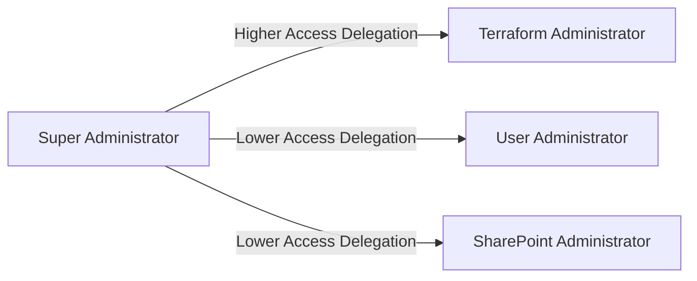

# Overview
Bootstrapping the cloud resource management consists of the following steps:

## Powershell Script to create resources

The first step in the bootstrap process is to create the terraform backend required to run and store state data. This
is done by this [script](ps-scripts/create-tf-state-bucket.ps1).

---
### Pre-requisites

##### Linux
**Azure CLI**:
Azure CLI by running:
 ```textmate
 curl -sL https://aka.ms/InstallAzureCLIDeb | sudo bash
 ```
**PowerShell Core**:

Ensure PowerShell Core is installed on your system. You can download it from [PowerShell official site](https://docs.microsoft.com/en-us/powershell/scripting/install/install-powershell?view=powershell-7.3).

#### MacOS
**Azure CLI**:

Install Azure CLI by running:
```textmate
brew install azure-cli
```
**PowerShell Core**:

Ensure PowerShell Core is installed on your system. You can download it from [PowerShell official site](https://docs.microsoft.com/en-us/powershell/scripting/install/install-powershell?view=powershell-7.3).

#### Windows
**Azure CLI**:

Install Azure CLI by running:
```powershell
winget install --id Microsoft.AzureCLI -e
```

**PowerShell Core**:

Ensure PowerShell Core is installed on your system. You can download it from [PowerShell official site](https://docs.microsoft.com/en-us/powershell/scripting/install/install-powershell?view=powershell-7.3).

---

### Example Run

To run the script, follow these steps:

1. Open a terminal or PowerShell window.
2. Navigate to the directory containing `create-tf-state-bucket.ps1`.
3. Execute the script with the following command:
```textmate
$ pwsh create-tf-state-bucket.ps1
You are already logged in to Azure.
You appear to have sufficient permissions to create resources.
Enter Resource Group name [rg-tfstate]:
Enter Storage Account name (sanitized to meet Azure rules) [tfstate]:
Provided storage account name 'tfstate' is not globally unique. Using 'tfstate7shrl' instead.
Enter Blob Container name [tfstate]:
Enter Azure Location (e.g., eastus, centralindia) [centralindia]:
Resource group 'rg-tfstate' already exists.
Creating storage account 'tfstate7shrl' in resource group 'rg-tfstate' (location: centralindia)...
Applying lifecycle management policy to tfstate7shrl...
Creating storage container 'tfstate' in the storage account 'tfstate7shrl'...
```

### Terraform Backend

Given the output above, the terraform back end file will look like
```terraform
terraform {
  backend "azurerm" {
    resource_group_name = "rg-tfstate"
    storage_account_name = "tfstate7shrl"
    container_name = "tfstate"
    key = "customized-for-recipe"  ### Will Change for every recipe ###
  }
}
```

This forms the basis for both production and staging environments. Since Production and staging accounts are different
the file contents will be different. However, most terraform recipes will have two back end files:
1. azurerm.staging.tfbackend -> Staging backend state.
2. azurerm.prod.tfbackend    -> Production backend state.

The appropriate back end is then chosen based on the environment, while initializing the backend via the CLI option (-backend-config)

## 2. Intermediate Proxy App Terraform recipe
Azure CLI and in general Microsoft Cloud application is a tricky beast. AZ CLI is a multi-tenant application, which means
it's permission set is restricted. However, Azure AD terraform provider itself is evolving to use the MS Graph API, and
it requires multiple permissions. This creates a conflict which Microsoft has not been able to resolve so far, because
Azure CLI is a first party Microsoft App. Hence, whenever new permissions are required, we need a new third party app,
to be plugged in, with terraform.

The terraform recipe intermediate-proxy-app is that recipe. It creates a new app with credentials and custom permission
that is used for further resource management in terraform. Apart from Azure CLI, it needs terraform to be installed.

---
### Pre-requisites

##### Linux
**Terraform**:

Install Terraform by running:
```textmate
sudo apt install terraform
```
#### MacOS
**Terraform**:

Install Terraform by running:
```textmate
brew install terraform
```

#### Windows
**Terraform**:

Install Terraform by running:
```powershell
winget install --id Hashicorp.Terraform -e
```
---

### Example Run

To run the script, follow these steps:

1. Open a terminal or PowerShell window.
2. Login to Azure (be sure about the production vs staging difference):
```textmate
    $ az login
```

In general, the following tips will help:
* Using "az login -tenant <tenant-id>" can be used to distinguish tenants (Prod and Staging).
* Use browser profiles to keep accounts separate (If you are using two browsers for Prod and Staging, you are doing it wrong).

Execute the script with the following command (on staging)
```textmate
$ cd bootstrap/intermediate-proxy-app
$ terraform init -backend-config=azurerm.staging.tfbackend -var-file=staging.tfvars
$ terraform apply -var-file=staging.tfvars
```

On Production, only the variables change as below:
```textmate
$ terraform init -backend-config=azurerm.prod.tfbackend -var-file=prod.tfvars
$ terraform apply -var-file=prod.tfvars
```

Note this pattern because every terraform run and script follows the same model. In the case of this recipe (intermediate-proxy-app),
there is only one variable that differs between production and staging - Azure Subscription ID. That can be obtained by looking at
the output of 'az account show'. For instance, the staging environment displays the output below (Assume JQ is installed on a WSL or Linux or Mac Console):
```textmate
$ az account show | jq '.id'
"d32407a7-5c5f-4491-ad3a-f2731fec7b4d"
```

The prod.tfvars must be modified to use the Azure Production subscription.

## 3. Terraform Administrator Recipe
The basic idea behind the Terraform Administrator recipe is:
a. It is a custom role that allows making configuration changes via terraform easy through scripting.
b. It then creates a group to which this role is assigned.
c. Then this group is PIM enabled, where Just-in-Time authorization is required for users in this group to activate it.
d. And finally adds users to this group.
e. Then users who need to be added to other built-in roles with PIM are also added as part of the recipe.
f. Finally, resource groups to which this role must have owner access should be specified separately so that the administrator
   action is only allowed for these resource groups.

Because the roles (both custom and built-in) are enabled with PIM access, the users need to have Entra ID P2 license enabled.
If this license is not bought or enabled for tenant or is not assigned to the users, then the recipe will fail.

To run the recipe, use the standard terraform 2 liner described above.

### Resource group limitation
The terraform administrator group role can't have access on all Azure resources. Hence it must be restricted to only
resource groups. Those are specified within the vars file as below:
```terraform
# Owner access to be given to these resource group names
resource_groups_owner_access = [
  "myden-staging"
]
```

This means that these resource groups must be created out of terraform either via CLI or UI and the recipe needs to be
re-run.

### Supporting Scripts and processes
A user or many users can be assigned to be a terraform administrator, by modifying the variable terraform-admin-group-eligible-users (see inputs.tf) as below.
```terraform
terraform-admin-group-eligible-users = [
  "user1@domain.onmicrosoft.com",
  "user2@domain.onmicrosoft.com",
  "user3@domain.onmicrosoft.com"
]
```
MFA must be enforced for all these users either via CLI or UI (This has to be done manually). For a detailed step-wise
sequence of how to do it see [here](https://learn.microsoft.com/en-us/entra/identity/authentication/howto-mfa-userstates).

Once the MFA enablement is done, the script (activate-pim-group.ps1)[ps-scripts/activate-pim-group.ps1] can be run as shown below:
```textmate
$ pwsh ps-scripts/activate-pim-group.ps1
Connecting to Microsoft Graph... A browser window will open for interactive sign-in.

Role-assignable Groups:

[1] Terraform Administrator Group - access: member  (5f8151ac-48eb-4af0-83e0-329aa9828a66)

You can select multiple groups by entering comma-separated numbers
(e.g., 1,3,5).
Enter the number(s) of the group(s) you want to activate: 1
1
You are about to submit activation for the following selection:


DisplayName                   GroupId                              Access
-----------                   -------                              ------
Terraform Administrator Group 5f8151ac-48eb-4af0-83e0-329aa9828a66 member


Proceed to submit activation requests? (y/N): Y

✅ Activation request submitted for group: Terraform Administrator Group (5f8151ac-48eb-4af0-83e0-329aa9828a66)
Status     : Provisioned
Expires At :
```

The script above can also extend an assignment based on administrative approval. See below for an example usage:
```textmate
Connecting to Microsoft Graph... A browser window will open for interactive sign-in.

Role-assignable Groups:

[1] Terraform Administrator Group - access: member  (5f8151ac-48eb-4af0-83e0-329aa9828a66)

You can select multiple groups by entering comma-separated numbers
(e.g., 1,3,5).
Enter the number(s) of the group(s) you want to activate: 1
1
You are about to submit activation for the following selection:


DisplayName                   GroupId                              Access
-----------                   -------                              ------
Terraform Administrator Group 5f8151ac-48eb-4af0-83e0-329aa9828a66 member


Proceed to submit activation requests? (y/N): Y

✅ Extend request submitted for group: Terraform Administrator Group (5f8151ac-48eb-4af0-83e0-329aa9828a66)
Status     : PendingAdminDecision
New Expires At : 11/23/2025 2:20:20 PM
```

The terraform recipe also allows individuals to be assigned to specific roles as shown below:
```terraform
terraform-builtin-roles-users = {
  "Attribute Assignment Administrator" = [
    "anand.v@Denave064.onmicrosoft.com"
  ],
  "User Administrator" = [
    "anand.v@Denave064.onmicrosoft.com"
  ],
  "SharePoint Administrator" = [
    "rohit.b@Denave064.onmicrosoft.com"
  ]
}
```
The roles are also automatically assigned to the Terraform administrator group. However, if some users only need to be
given access to a specific role without becoming a part of the Terraform administrator group, the above fragment is how it
is done. In the example above "Rohit B" is given Share Point administrator access separately, but "Anand V" is given the
same role, by virtue of being a member of "Terraform Administrator" group.

If Rohit B, wants to activate his role of "Share Point Administrator", he has to run the [PIM Role Script](ps-scripts/activate-pim-role.ps1) as shown below:
```textmate
$ pwsh ps-scripts/activate-pim-role.ps1
Connecting to Microsoft Graph... A browser window will open for interactive sign-in.

Eligible Directory Roles:

[1] Attribute Assignment Administrator  RoleDefId: 58a13ea3-c632-46ae-9ee0-9c0d43cd7f3d  Scope: /
[2] User Administrator  RoleDefId: fe930be7-5e62-47db-91af-98c3a49a38b1  Scope: /
[3] SharePoint Administrator  RoleDefId: f28a1f50-f6e7-4571-818b-6a12f2af6b6c  Scope: /
\nYou can select multiple roles by entering comma-separated numbers
(e.g., 1,3,5).
Enter the number(s) of the role(s) you want to activate: 1,2,3

✅ Activation request submitted for role: Attribute Assignment Administrator (RoleDefId: 58a13ea3-c632-46ae-9ee0-9c0d43cd7f3d)
Status     : Provisioned
Expires At :

✅ Activation request submitted for role: User Administrator (RoleDefId: fe930be7-5e62-47db-91af-98c3a49a38b1)
Status     : Provisioned
Expires At :

✅ Activation request submitted for role: SharePoint Administrator (RoleDefId: f28a1f50-f6e7-4571-818b-6a12f2af6b6c)
Status     : Provisioned
Expires At :
```

## Conclusion
All recipes, scripts and other artifacts in the bootstrap/ folder must be run by the Global Administrator and/or owner
of the Azure subscription. The first act of delegation by the Global Administrator is to the Terraform administrator
role and related roles based on values specified in staging.tfvars and prod.tfvars as shown below:


The administrative action needs to
be controlled and the recipes must be re-run, whenever there are changes required. A few examples of these changes are
given below:
a. Changing the permission set of the Intermediate Proxy App (e.g. Addition, Deletion, Modification).
b. Modifying Administrative roles and users for Terraform administrator recipe.
c. Adding new resource groups for which Terraform administrator role must have access.
