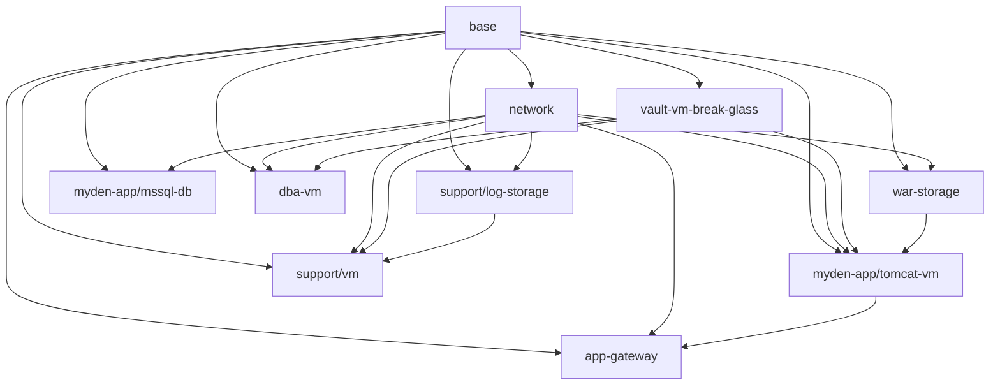

# MyDen Deployment Dependencies & Run Order

What must run first, and what follows. Ordering is derived from the explicit Terragrunt `dependency` blocks in each unit's `terragrunt.hcl` (these also drive `run-all` apply order). No circular dependencies exist — the graph is a DAG rooted at `base`.

---

## 0. Prerequisite phases (run before the cloud stack)

These are standalone Terraform roots, not Terragrunt units. They are ordered by hand, not by `dependency` blocks.

| Order | Component | Path | Why it comes first |
| --- | --- | --- | --- |
| P1 | TF state bucket | `bootstrap/ps-scripts/create-tf-state-bucket.ps1` | Creates `rg-tfstate` / `tfstate7shrl` that every backend uses. |
| P2 | Intermediate proxy app | `bootstrap/intermediate-proxy-app/` | Azure AD app granting Graph permissions for the admin phase. |
| P3 | Terraform administrator | `bootstrap/terraform-administrator/` | Reads the proxy app state (`proxy_app_workspace`); creates the TF admin role/group + PIM. |
| P4 | Golden images (Packer) | `vm-images/packer/win2022-server-azure/`, `vm-images/packer/win2022-server-dba-desktop/` | Builds `win2022-tomcat-base` and `win2022-server-dba-desktop` images into RG `golden-images`, consumed later by the VM units. |

`single-sign-on/` is **independent** of the cloud stack — it can run any time after the tenant exists and has no dependency on `base`/`network`.

---

## 1. Cloud-stack run order (`cloud-stack/live/staging/`)

Run per-unit with `terragrunt apply` inside each directory, or all at once with `terragrunt run --all apply` from `cloud-stack/live/staging/` (Terragrunt resolves this order automatically).

```
Tier 0  base                     ← run first, nothing depends on before it
          │
Tier 1  network                  (needs: base)
        vault-vm-break-glass      (needs: base)
          │
Tier 2  war-storage              (needs: base, network)
        support/log-storage      (needs: base, network)
        myden-app/mssql-db        (needs: base, network)
        dba-vm                    (needs: base, network, vault-vm-break-glass)
          │
Tier 3  myden-app/tomcat-vm       (needs: base, network, war-storage, vault-vm-break-glass)
        support/vm                (needs: base, network, vault-vm-break-glass, log-storage)  [enabled=false]
          │
Tier 4  app-gateway              (needs: network, base, myden-app/tomcat-vm)
```

`myden-app/` and `support/` themselves are grouping units (`modules/_noop`) — they carry no resources and only exist so `run-all` can traverse their children.

---

## 2. Per-unit dependency table

| Unit | Depends on (must run first) | Consumed by (runs after this) |
| --- | --- | --- |
| `base` | — | network, vault-vm-break-glass, war-storage, log-storage, mssql-db, dba-vm, tomcat-vm, support/vm, app-gateway |
| `network` | base | war-storage, log-storage, mssql-db, dba-vm, tomcat-vm, support/vm, app-gateway |
| `vault-vm-break-glass` | base | dba-vm, tomcat-vm, support/vm |
| `war-storage` | base, network | tomcat-vm |
| `support/log-storage` | base, network | support/vm |
| `myden-app/mssql-db` | base, network | — (leaf) |
| `dba-vm` | base, network, vault-vm-break-glass | — (leaf) |
| `myden-app/tomcat-vm` | base, network, war-storage, vault-vm-break-glass | app-gateway |
| `support/vm` (`enabled=false`) | base, network, vault-vm-break-glass, log-storage | — (leaf) |
| `app-gateway` | network, base, myden-app/tomcat-vm | — (leaf) |

**Roots (start here):** `base` (then `vault-vm-break-glass` and `network`).
**Leaves (finish here):** `mssql-db`, `dba-vm`, `support/vm`, `app-gateway`.
**Hubs:** `base` (used by all) and `network` (used by all resource units except vault).

---

## 3. Dependency graph



---

## 4. What flows between units (why the order matters)

| Producer | Output the next unit needs | Consumer |
| --- | --- | --- |
| `base` | `resource_groups[...]` | all resource units |
| `base` | `ad_groups[...]`, `ad_groups_rdp_access` | network, mssql, VMs, vault, log-storage |
| `base` | `managed_identities[...]` (id, principal_id, client_id, tenant_id, resource_group_name) | war-storage, tomcat-vm, dba-vm, log-storage, app-gateway |
| `base` | `managed_applications[...]` (application_id, service_principal_id, tenant_id, password) | war-storage |
| `network` | `top_level_network.{app_subnet_ids, app_subnet_prefixes, subnet_nic_map, waf_subnet, dba_subnet, support_subnet}` | war-storage, log-storage, mssql, VMs, app-gateway |
| `vault-vm-break-glass` | `break_glass_keyvault.{id, name, ...}` | tomcat-vm, dba-vm, support/vm |
| `war-storage` | `shares.*`, `keyvault.{name, secret_names.for_mounting_vms}` | tomcat-vm |
| `log-storage` | `shares.{storage_account_name, container_name}` | support/vm |
| `tomcat-vm` | `vm_data.{ip_addresses, machine_name}` | app-gateway (WAF backend pool) |

---

## 5. Quick apply/destroy rules

- **Apply:** `base` → `network`/`vault-vm-break-glass` → storage + db + dba-vm → tomcat-vm/support-vm → app-gateway. Or just `terragrunt run --all apply` from `cloud-stack/live/staging/`.
- **Destroy:** reverse order. `terragrunt run --all destroy` handles it; if going manually, tear down leaves first (`app-gateway`, then VMs, then storage/db, then `network`/`vault`, then `base`).

> Terragrunt CLI note: newer Terragrunt replaced the top-level `run-all` with `run --all` (e.g. `terragrunt run --all apply`). If you get `unknown command: "run-all"`, use the `run --all` form.
- `mock_outputs` let each unit `plan`/`validate` standalone before its dependencies exist, but a real `apply` still requires the upstream units to be applied first.
