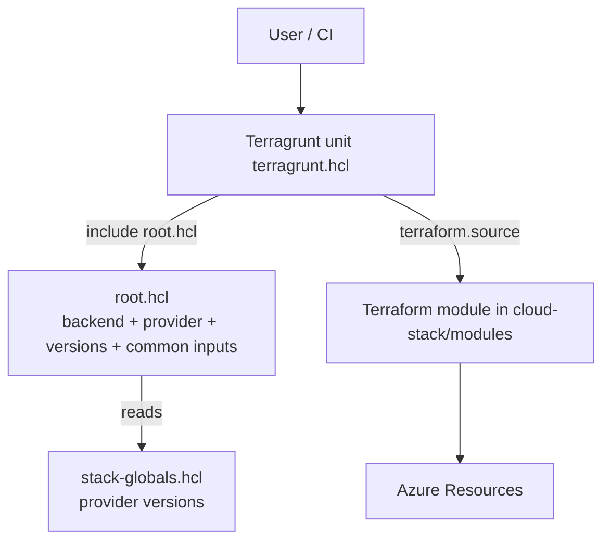
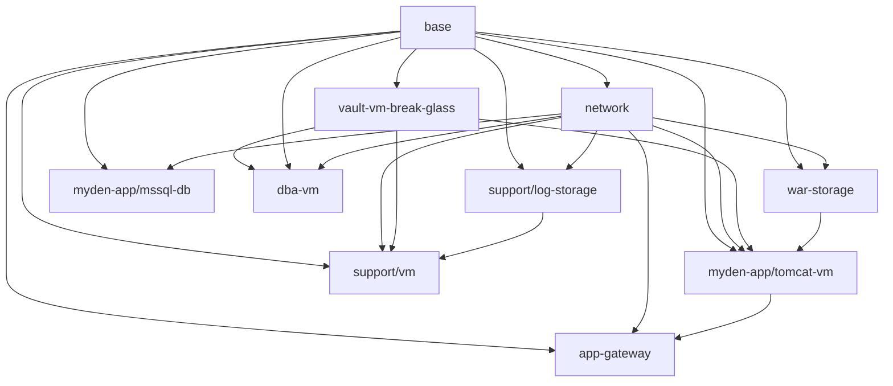

# MyDen Infrastructure Flow

Azure infrastructure for the MyDen project, provisioned with **Terraform + Terragrunt**.

- **Terragrunt live tree:** `cloud-stack/live/staging/`
- **Terraform modules:** `cloud-stack/modules/`
- **Environment root:** `cloud-stack/live/staging/root.hcl`
- **Version pinning:** `cloud-stack/live/stack-globals.hcl`

## Entry points

Terragrunt units (each a directory with a `terragrunt.hcl`) are the entry points. Run per-unit with `terragrunt plan/apply` from inside the unit, or across the tree with `terragrunt run-all plan/apply` from `cloud-stack/live/staging/`.

`myden-app/` and `support/` are **grouping units** that point at the `_noop` module so `run-all` can traverse them without hitting a real Terraform root.

## High-level flow

## Terragrunt -> Terraform module mapping

| Terragrunt unit | `terraform.source` module | Azure resources (summary) |
| --- | --- | --- |
| `base` | `modules/base` | Resource groups, AD groups, managed identities, managed applications |
| `network` | `modules/network` | VNet, subnets (app/waf/dba/support), NICs, NSGs, Bastion, public IP, DNS zone |
| `war-storage` | `modules/war-storage` | Storage account + file share, 2 Key Vaults, SAS token, Log Analytics, RBAC |
| `vault-vm-break-glass` | `modules/vault-vm-break-glass` | Break-glass Key Vault + access |
| `support/log-storage` | `modules/log-storage` | Log storage account + container + RBAC |
| `myden-app/mssql-db` | `modules/mssql-serverless` | MSSQL server + databases + firewall/VNet rules |
| `myden-app/tomcat-vm` | `modules/windows-app-vm` | Windows app VM, data disks, WAR mount, AAD join |
| `dba-vm` | `modules/dba-access-vm` | DBA Windows VM, disks, Key Vault, storage |
| `support/vm` | `modules/support-vm` | Support Windows VM (`enabled = false`) |
| `app-gateway` | `modules/app-waf` | Application Gateway WAF, firewall policy, certs, DNS |
| `myden-app`, `support` | `modules/_noop` | Grouping only (no resources) |

## Dependency chain (explicit Terragrunt `dependency`)

All dependencies are **explicit** via Terragrunt `dependency` blocks (which also drive apply ordering). There are no `dependencies { paths = [...] }` blocks and no in-module `depends_on` across units — ordering is entirely output-driven. No circular dependencies were found.

## Key inputs and outputs crossing unit boundaries

| Producer | Output consumed | Consumer(s) |
| --- | --- | --- |
| `base` | `resource_groups[...]` | network, war-storage, vault, log-storage, mssql, tomcat-vm, dba-vm, support-vm |
| `base` | `ad_groups[...]`, `ad_groups_rdp_access` | network, mssql, tomcat-vm, dba-vm, support-vm, vault, log-storage |
| `base` | `managed_identities[...]` (full identity object: `id`, `principal_id`, `client_id`, `tenant_id`, `resource_group_name`, `name`) | war-storage, tomcat-vm, dba-vm, log-storage, app-gateway |
| `base` | `managed_applications[...]` (`application_id`, `service_principal_id`, `tenant_id`, `password`) | war-storage |
| `network` | `top_level_network.{app_subnet_ids, app_subnet_prefixes, subnet_nic_map, waf_subnet, dba_subnet, support_subnet}` | app-gateway, war-storage, log-storage, mssql, tomcat-vm, dba-vm, support-vm |
| `vault-vm-break-glass` | `break_glass_keyvault.{id, name, ...}` | tomcat-vm, dba-vm, support-vm |
| `war-storage` | `shares.*`, `keyvault.{name, secret_names.for_mounting_vms}` | tomcat-vm |
| `log-storage` | `shares.{storage_account_name, container_name}` | support/vm |
| `windows-app-vm` (tomcat-vm) | `vm_data.{ip_addresses, machine_name}` | app-gateway (WAF backend) |

## Variable definition & override points

- **Common inputs** (`environment`, `location`, `tags`) are set once in `root.hcl` `inputs` and inherited by every unit through `include "env"`.
- **Version pins** live only in `stack-globals.hcl` and are rendered into each unit's generated `provider_versions.tf`.
- **Per-unit inputs** (sizing, names, network CIDRs, resource-group selection) are set in each unit's `terragrunt.hcl` `inputs` block and map to that module's variables in `inputs.tf`.
- **`local.environment`, `local.location`, subscription id** are defined in `root.hcl` `locals` and reused via `include.env.locals.*`.

## Backend / state

Single `remote_state` block in `root.hcl` (azurerm): resource group `rg-tfstate`, storage account `tfstate7shrl`, container `tfstate`, key `${path_relative_to_include()}/terraform.tfstate`. Each unit gets an isolated state key derived from its path relative to `root.hcl`.
